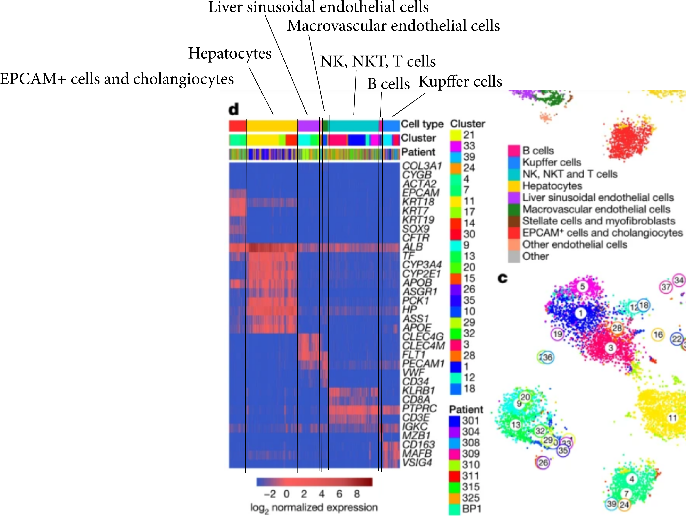

## Aizarani dataset

```{r setup, include=FALSE}
knitr::opts_chunk$set(echo = TRUE)
library(Seurat)
library(tidyverse)

```

Load Aizarani data. I'm using their count matrix 'NormalHumanLiverData' from GEO accession GSE124395.

```{r}
GEO <- readRDS("../data/GEO/GSE124395/GSE124395_Normalhumanliverdata.RData")


aizarani <- CreateSeuratObject(GEO, project="Aizarani_Healthy", min.cells=3, min.features = 300)
VlnPlot(aizarani, features = c("nFeature_RNA", "nCount_RNA"), ncol = 2)

#aizarani <- subset(aizarani, subset = nFeature_RNA > 300 & nFeature_RNA < 2500 & percent.mt < 30)


# get the cluster ids that correspond to each cell
paper_clusters <- read.table("../data/GEO/GSE124395/GSE124395_clusterpartition.txt")

# only keep cells which have a cluster assigned in this table
aizarani[['in.paper.clusters']] <- case_when(
  colnames(aizarani) %in% rownames(paper_clusters) ~ TRUE,
  TRUE ~ FALSE
)
aizarani <- subset(aizarani, in.paper.clusters)

# assign clusters from paper to metadata column
paper_clusters_df <- tibble(
  cellname = rownames(paper_clusters),
  cluster = paper_clusters$sct.cpart
)

aizarani_cellnames <- tibble(cellname = colnames(aizarani)) %>% 
  left_join(paper_clusters_df, by="cellname") 


aizarani[["paper.clusters"]] <- aizarani_cellnames$cluster


```


Has this dataset already been filtered?  

The names on the x-axis come from the cell names in the data that I downloaded from the GEO.  I'm not sure what they mean, but some of them might refer to clusters?  They mention things like 'CD34'.

Finding varable features:

```{r}
aizarani <- NormalizeData(aizarani, normalization.method = "LogNormalize", scale.factor = 10000)

aizarani <- FindVariableFeatures(aizarani, selection.method = "vst", nfeatures = 2000)

top10 <- head(VariableFeatures(aizarani), 10)

# plot variable features with and without labels
plot1 <- VariableFeaturePlot(aizarani)
plot2 <- LabelPoints(plot = plot1, points = top10, repel = TRUE)
plot2
```

Running PCA:

```{r}
all.genes <- rownames(aizarani)
aizarani <- ScaleData (aizarani, features=all.genes)

aizarani <- RunPCA(aizarani, features = VariableFeatures(object = aizarani))
```

Top two PCR dimensions:
```{r}
VizDimLoadings(aizarani, dims = 1:2, reduction = "pca")
```
UMAP with clusters:
```{r include=FALSE}
aizarani <- FindNeighbors(aizarani, dims = 1:13)
aizarani <- FindClusters(aizarani, resolution = 0.5)
aizarani <- RunUMAP(aizarani, dims = 1:30)


```
```{r}
DimPlot(aizarani, reduction="umap")
```


t-SNE with clusters:
```{r include=FALSE}
aizarani <- RunTSNE(aizarani)

```

```{r}
DimPlot(aizarani, reduction="tsne")
```


Finding markers for the clusters:
```{r include=FALSE}
aizarani.markers <- FindAllMarkers(aizarani, only.pos=TRUE, min.pct=0.25, logfc.threshold = 0.25)
```

Top three markers for each cluster:
```{r}
 aizarani.markers %>%
     group_by(cluster) %>%
     slice_max(n = 3, order_by = avg_log2FC)
```
Figure 1d from the paper looks liks this:




Try to reproduce the heatmap:
```{r}
paper_genes  <- c("COL3A1", "CYGB", "ACTA2", "EPCAM", "KRT18", "KRT7", "KRT19", "SOX9", "CFTR", "ALB", "TF", "CPY3A3", "CYP2E1","APOB", "ASGR1", "PCK1", "HP", "ASS1", "APOE", "CLEC4G", "CLEC4M", "FLT1", "PECAM", "VWF", "CD34", "KLRB1", "CD8A", "PTPRC", "CD3E", "IGKC", "MZB1", "CD163", "MAFB", "VSIG4")
DoHeatmap(aizarani, features=paper_genes)
```

We can try to figure out which of the Seurat clusters correspond to which kinds of cells using Figure 1 from the paper together with the above heatmap.

- 0: NK, NKT, T cells
- 1: liver sinusoidal endothelial cells
- 2: EPCAM+ cells and cholangiocytes
- 3: hepatocytes
- 4: Kupffer cells
- 5: hepatocytes
- 6: NK, NKT, T cells
- 7: hepatocytes
- 8: macrovascualar endothelial cells
- 9: hepatocytes
- 10: ?
- 11: ?
- 12: B cells
- 13: EPCAM+ cells and cholangiocytes
- 14: ?
- 15: ?
- 16: hepatocytes


It's a bit harder to tell what some of the smaller clusters are. 


```{r}
new.cluster.ids <- c("NK, NKT, T cells",
                     "NK, NKT, T cells",
                     "liver sinusoidal endothelial cells",
                     "Kupffer cells",
                     "hepatocytes",
                     "EPCAM+ cells and cholangiocytes",
                     "hepatocytes",
                     "hepatocytes", 
                     "macrovascual endothelial cells",
                     "liver sinusoidal endothelial",
                     "hepatocytes",
                     "?",
                     "?",
                     "B cells",
                     "?",
                     " EPCAM+ cells and cholangiocytes", 
                     "?",
                     "?",
                     "?")


#names(new.cluster.ids) <- levels(aizarani)
#aizarani <- RenameIdents(aizarani, new.cluster.ids)
#DimPlot(aizarani, reduction = "umap", pt.size = 0.5) 
```
Turns out, the GEO entry also includes the cluster to which each cell was assigned in the original paper.  Have a look at those clusters:
```{r}

DimPlot(aizarani, reduction = "umap", pt.size = 0.5, group.by = "paper.clusters") 
```

By comparing figure 1b and 1c, we can assign names to the cluster numbers.  I did this by using the [webapp they made](http://human-liver-cell-atlas.ie-freiburg.mpg.de/) which allowed me to visualise the clusters one by one, and compared this with figure 1b in the paper.

I'm not all that confident about the names that I assigned to clusters 32, 33 and 35, but there aren't too many cells in those clusters so I don't think it's a huge deal.

```{r include=FALSE}
paper.cluster.names <- tibble(
  name = c("NK, NKT, T cells", "Kupffer cells", "NK, NKT, T cells", "EPCAM+ cells and cholangiocytes", "NK, NKT, T cells", "Kupffer cells", "EPCAM+ cells and cholangiocytes", "B cells", "Liver sinusoidal endothelial cells", "Macrovascular endothlial cells", "Hepatocytes", "NK, NKT, T cells", "Liver sinusoidal endothelial cells", "Hepatocytes", "Other endothelial cells", "Other", "Hepatocytes", "NK, NKT, T cells", "Other", "Liver sinusoidal endothelial cells", "Stellate cells and myofibroblasts", "B cells", "Kupffer cells", "EPCAM+ cells and cholangiocytes", "Kupffer cells", "Other endothelial cells", "Other", "NK, NKT, T cells", "Macrovascular endothlial cells", "Hepatocytes", "Kupffer cells", "NK, NKT, T cells", "Stellate cells and myofibroblasts", "B cells", "Other endothelial cells", "Other", "Other", "B cells", "Other"),
  cluster = seq(length(name))
)

paper_clusters_df %>% 
  count(cluster) %>% 
  left_join(paper.cluster.names, by="cluster") %>% 
  rename(n_cells = n)


aizarani_cellnames <- aizarani_cellnames %>% 
  left_join(paper.cluster.names, by="cluster")

aizarani[['paper.cluster.names']] <- aizarani_cellnames$name
```

```{r}
DimPlot(aizarani, reduction = "umap", pt.size = 0.5, group.by = "paper.cluster.names") 
```
These annotations make sense in the sense that the different clusters containing the same kinds of cells are annotated together.

```{r}
p1 <- DoHeatmap(aizarani, features=paper_genes) + NoLegend() + ggtitle("seruat clusters")
p2 <- DoHeatmap(aizarani, features=paper_genes, group.by="paper.clusters") + NoLegend() + ggtitle("paper clusters")
p3 <- DoHeatmap(aizarani, features=paper_genes, group.by="paper.cluster.names") + NoLegend() + ggtitle("paper cell types")
cowplot::plot_grid(p1, p2)
```
```{r fig.height=7, fig.width=7}
p3
```


## Markers of zonation

In this reference dataset, the authors identify the following genes which indicate zonation:

periportal module 1: ALB and PCK1 (Aizarani: ANPEP)
centra(/midzonal modules 34 and 24: (literature: CYP1A2, CYP2E1), (Aizarni:  CD14)
central module 33: GLUL

```{r fig.height = 15, fig.width=15}
FeaturePlot(aizarani, features = c("ALB", "PCK1", "ANPEP", "CYP1A2", "CYP2E1", "CD14", "GLUL", "APOE"))
```


## Integration 


Try mapping the sample hep1 onto the Aizarani reference
```{r include=FALSE}
source('workflow.R')
data.obj <- import_without_mouse()

# apparently need to have return.model=TRUE set, otherwise MapQuery doesn't work
aizarani.reference <- RunUMAP(aizarani, dims = 1:30, reduction = "pca", return.model = TRUE)

refplot <- DimPlot(aizarani.reference, reduction="umap", group.by="paper.cluster.names") + ggtitle("Aizarani reference") 


mapHepQuery <- function(query, k.filter=200) {
  
  query <- NormalizeData(query, normalization.method = "LogNormalize", scale.factor = 10000)
  query <- FindVariableFeatures(query, selection.method = "vst", nfeatures = 2000)
  anchors <-  FindTransferAnchors(reference=aizarani, query=query,
                                   dims = 1:30, reference.reduction = "pca",
                                  k.filter=k.filter)
  query <-  MapQuery(anchorset = anchors, 
                       reference=aizarani.reference,
                       query=query, 
                       refdata = list(paper.cluster.names="paper.cluster.names",
                                      paper.cluster="paper.clusters"), 
                       reference.reduction="pca",
                       reduction.model = "umap")
}

#names(data.obj)
hep1.mapped <- mapHepQuery(data.obj[["hep1"]])
hep1.plot <- DimPlot(hep1.mapped, reduction = "ref.umap", group.by="predicted.paper.cluster.names") + ggtitle("hep1")
legend <- cowplot::get_legend(refplot)
#cowplot::plot_grid(refplot, hep1.plot)


```

```{r}
cowplot::plot_grid(refplot + NoLegend(), hep1.plot + NoLegend(), legend)
```

How many of each predicted cell type do we have?
```{r}
#hep1.mapped[["predicted.paper.cluster.names"]]
table(hep1.mapped[["predicted.paper.cluster.names"]])
```


```{r}
hep2.mapped <- mapHepQuery(data.obj[["hep2"]])
hep2.plot <- DimPlot(hep2.mapped, reduction = "ref.umap", group.by="predicted.paper.cluster.names") +
  ggtitle("hep2")
```
Mapping hep1 and hep2:
```{r}
cowplot::plot_grid(refplot + NoLegend(),hep1.plot + NoLegend(), hep2.plot + NoLegend(), legend)
```


```{r}

#high1.mapped <- mapHepQuery("high1")
# Error in idx[i, ] <- res[[i]][[1]] : 
#  number of items to replace is not a multiple of replacement length

# apparently this error can occur sometimes because a sample las a low number of cells
# https://github.com/carmonalab/STACAS/issues/12
length(colnames(hep1.mapped))

purrr::map(data.obj, ~length(colnames(.)))
# but the nubmer of cells is more for high1 than samples that did work (low1, low2)

# try merging high1 and high2 together
#high <- merge(data.obj[['high1']], data.obj[['high2']])
#high.mapped <- mapHepQuery(high)
# Still has the same error
#Error in idx[i, ] <- res[[i]][[1]] : 
#  number of items to replace is not a multiple of replacement length

# try instead setting k.filter to NA
# https://github.com/satijalab/seurat/issues/4803

# this works
# high1.mapped <- mapHepQuery(data.obj[['high1']], k.filter=100)

#names(data.obj)

merged <- list(
  'hep' = merge(data.obj[['hep1']], data.obj[['hep2']]),
  'low' = merge(data.obj[['low1']], data.obj[['low2']]),
  'high' = merge(data.obj[['high1']], data.obj[['high2']]),
  'LK03C_REDHV' = merge(data.obj[['LK03C_REDHV1']], data.obj[['LK03C_REDHV2']]),
  'LK03V_REDHC' = merge(data.obj[['LK03V_REDHC1']], data.obj[['LK03V_REDHC2']])
)


# mapHepQuery(merged[['hep']], k.filter=150)
# mapHepQuery(merged[['low']], k.filter=150)
# mapHepQuery(merged[['high']], k.filter=150)
# mapHepQuery(merged[['LK03C_REDHV']], k.filter=150)
# mapHepQuery(merged[['LK03V_REDHC']], k.filter=150)
# 
# data.obj.mapped <- purrr::map(merged, ~mapHepQuery(., k.filter=150))
```


```{r}
sessionInfo()
```

