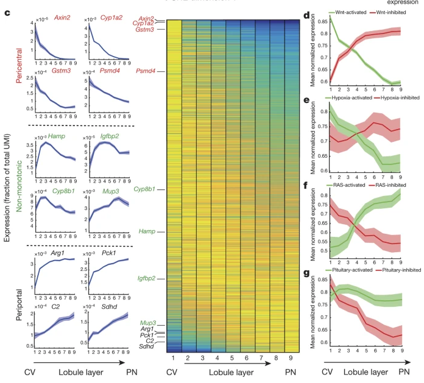

## Assigning cell types


```{r setup, include=FALSE}
knitr::opts_chunk$set(fig.width = 7, fig.height=5, dev = c('pdf', 'png'))
library(Seurat)
library(tidyverse)
library(RColorBrewer)
library(patchwork)
library(cowplot)
library(ggrepel)
source("workflow.R")
```

```{r include=FALSE}
data <- integrated_with_aizarani()
reference <- data[['aizarani']]
queries <- data[names(data) != 'aizarani']
```

### Aizarani cell types
The datasets, mapped to the Aizarani dataset.  Note that here I'm using labels that I inferred from the cluster numbers, which came with the dataset.

```{r}
# custom colors so that we have the same colors for the same clusters in each plot, regardless of which clusters are in each plot
# https://stackoverflow.com/questions/6919025/how-to-assign-colors-to-categorical-variables-in-ggplot2-that-have-stable-mappin


cellTypes <- unique(reference$paper.cluster.names)
myColors <- brewer.pal(length(cellTypes),"Set3")
names(myColors) <- cellTypes
colScale <- scale_colour_manual(name = "grp",values = myColors)


refplot <- DimPlot(reference, reduction="umap", group.by="paper.cluster.names") + ggtitle("Aizarani") + colScale
queryplots.aizarani <- purrr::map(names(queries), 
                       ~DimPlot(queries[[.]], reduction="ref.umap", group.by="predicted.paper.cluster.names") + 
                         ggtitle(str_split(., "\\.")[[1]][1]) + 
                         xlim(-15, 15) + 
                         ylim(-12.5, 10) +
                         colScale +
                         NoLegend()
                       
                       )
# https://stackoverflow.com/questions/27130610/legend-on-bottom-two-rows-wrapped-in-ggplot2-in-r
legend <- cowplot::get_legend(refplot + 
                                theme(legend.position="bottom", legend.title = element_blank(),) + 
                                guides(fill=guide_legend(nrow=2,byrow=TRUE))
                              )


aizarani.plots <- plot_grid(plotlist=c(list(refplot + NoLegend()), queryplots.aizarani))
plot_grid(aizarani.plots, legend, ncol=1, rel_heights = c(1, 0.1))
```

Just the reference, hepatocytes pre-engraftment, and the 'high' post-engraftment subset


```{r}

title_theme <- theme(plot.title=element_text(size=9, hjust=0))

aizarani.plots.selected1 <- plot_grid(refplot + NoLegend() + ggtitle("Aizarani, 2019\nGSE124395\nNormal human liver tissue") + title_theme, 
                                      queryplots.aizarani[[1]] + ggtitle("Human 'Hepatocyes'\nLonza #181791\nPre-engraftment") + title_theme,
                                      queryplots.aizarani[[3]] + ggtitle("Human Hepatocyes\nLonza #181791\n5 months Post-engraftment") + title_theme,
                                      nrow = 1
                                      )

plot_grid(aizarani.plots.selected1, legend, ncol=1, rel_heights = c(1, 0.1))
```

Seurat gives a score to the predictions it makes when it maps a query dataset to a reference dataset, a measure of how confident it is in that mapping, which is between 0 and 1.  Here are the distribution of scores for each dataset.

```{r}
scorePlots <- purrr::map(names(queries), ~tibble(score = queries[[.]]$predicted.paper.cluster.names.score) %>% 
  ggplot(aes(x = score)) +
  geom_histogram() +
    ggtitle(.)
  )
cowplot::plot_grid(plotlist=scorePlots)
```
So Seurat is pretty confident about the cell types, but it's less confident about the assignment of some of the assignments in the hepatocytes sample.  Are these the ones that are not hepatocytes?  Make a plot, coloring by score:

```{r}
hep.score.plot <-  FeaturePlot(queries[[1]], reduction="ref.umap", feature="predicted.paper.cluster.names.score")

cowplot::plot_grid(refplot + NoLegend(), hep.score.plot)
```

It looks more like the cells with a lower score are spread throughout the cell types.  So perhaps there really are multiple cell types in this sample.

### Aizarani clusters

Now looking at the original clusters in the paper: 

```{r}
# custom colors so that we have the same colors for the same clusters in each plot, regardless of which clusters are in each plot
# https://stackoverflow.com/questions/6919025/how-to-assign-colors-to-categorical-variables-in-ggplot2-that-have-stable-mappin

library(scales)
clusterNames <- unique(reference$paper.clusters)
myColors <- scales::hue_pal()(length(clusterNames))
names(myColors) <- clusterNames
colScale <- scale_colour_manual(name = "grp",values = myColors)


refplot <- DimPlot(reference, reduction="umap", group.by="paper.clusters") + ggtitle("Aizarani") + colScale
queryplots.aizarani <- purrr::map(names(queries), 
                       ~DimPlot(queries[[.]], reduction="ref.umap", group.by="predicted.paper.cluster") + 
                         ggtitle(str_split(., "\\.")[[1]][1]) + 
                         xlim(-15, 15) + 
                         ylim(-12.5, 10) +
                         NoLegend() +
                         colScale
                       
                       )
# https://stackoverflow.com/questions/27130610/legend-on-bottom-two-rows-wrapped-in-ggplot2-in-r
legend <- cowplot::get_legend(refplot + 
                                theme(legend.position="right", legend.title = element_blank(),) + 
                                guides(fill=guide_legend(byrow=TRUE, nrow=2))
                              )


aizarani.plots <- plot_grid(plotlist=c(list(refplot + NoLegend()), queryplots.aizarani))
plot_grid(aizarani.plots, legend, nrow=1, rel_widths = c(1, 0.2))
```

Cowplot seems to have trouble with the legend, but you get the idea.

We should also check how confident Seurat is in the assignment of query cells to reference clusters.

```{r}
scorePlots <- purrr::map(names(queries), ~tibble(score = queries[[.]]$predicted.paper.cluster.score) %>% 
  ggplot(aes(x = score)) +
  geom_histogram() +
    ggtitle(glue::glue("."))
  )
cowplot::plot_grid(plotlist=scorePlots)
```

So it's not all that confident about the assignment of many cells to clusters from the original paper.  Perhaps we shouldn't use these labels.

### Hepatoctyes

Plotting just the hepatocyte subset of all the data, using the original labels from the paper.  The clusters here are also from the original paper (I haven't shown them for the query datasets, since they don't mean that much).


```{r}
reference.hep <- DimPlot(subset(reference, paper.cluster.names=="Hepatocytes"),
                         reduction="umap",
                         group.by="paper.clusters")
queries.hep <- purrr::map(names(queries), ~DimPlot(subset(queries[[.]], predicted.paper.cluster.names=="Hepatocytes"), 
                                                   reduction="ref.umap") + 
                         ggtitle(str_split(., "\\.")[[1]][1]) + 
                         xlim(-15, 15) + 
                         ylim(-12.5, 10) +
                         colScale +
                         NoLegend() +
                         ggtitle(.)
                         )

names(queries.hep) <- names(queries)

legend <- cowplot::get_legend(reference.hep + theme(legend.position="bottom"))
aizarani.hep.paper.clust <- cowplot::plot_grid(plotlist=c(list(reference.hep + NoLegend()), queries.hep))
aizarani.hep.paper.clust  <- cowplot::plot_grid(aizarani.hep.paper.clust, legend, ncol=1, rel_heights = c(1, 0.1))
aizarani.hep.paper.clust
```

The 'hepatoctye' cluster seems to contain cells that are far in UMAP space from the main hepatoctye cluster.  So maybe the 'Hepatocyte' label doesn't mean that much.

The data came with cluster number labels, but not cell type. To get the cell type labels, I looked at Figure 1 in the paper and tried to guess which of the seurat clusters corresponded to which of the cluster numbers.  This assumes that the Seurat clusters are the same as the clusters for the paper, but maybe with some of the paper clusters combined to get the seurat ones.  However, it could be that there's a lot of 

### Seurat clusters - assigning cell types

Perhaps it might be better to use the Seurat clusters and try to figure out what the cell types are.  These are the Seurat Clusters for the reference dataset:

```{r}
DimPlot(reference, reduction="umap", label = TRUE, repel = TRUE)
```


Previously I came up with this list: by comparing these two heatmaps:

- 0: NK, NKT, T cells
- 1: liver sinusoidal endothelial cells
- 2: EPCAM+ cells and cholangiocytes
- 3: hepatocytes
- 4: Kupffer cells
- 5: hepatocytes
- 6: NK, NKT, T cells
- 7: hepatocytes
- 8: macrovascualar endothelial cells
- 9: hepatocytes
- 10: ?
- 11: ?
- 12: B cells
- 13: EPCAM+ cells and cholangiocytes
- 14: ?
- 15: ?
- 16: hepatocytes


I did this by looking at these heatmaps and [the companion website for the paper](http://human-liver-cell-atlas.ie-freiburg.mpg.de/):

```{r fig.width=10, fig.height=10}
paper_genes  <- c("COL3A1", "CYGB", "ACTA2", "EPCAM", "KRT18", "KRT7", "KRT19", "SOX9", "CFTR", "ALB", "TF", "CPY3A3", "CYP2E1","APOB", "ASGR1", "PCK1", "HP", "ASS1", "APOE", "CLEC4G", "CLEC4M", "FLT1", "PECAM", "VWF", "CD34", "KLRB1", "CD8A", "PTPRC", "CD3E", "IGKC", "MZB1", "CD163", "MAFB", "VSIG4")
p1 <- DoHeatmap(reference, features=paper_genes) + NoLegend() + ggtitle("seruat clusters")
p2 <- DoHeatmap(reference, features=paper_genes, group.by="paper.clusters") + NoLegend() + ggtitle("paper clusters")
p3 <- DoHeatmap(reference, features=paper_genes, group.by="paper.cluster.names") + NoLegend() + ggtitle("paper cell types")
cowplot::plot_grid(p1, p2, p3, nrow=1)
```


But what about those clusters that I couldn't figure out (10, 11, 14 and 15)?  Let's assume that the cluster names that I figured out using the previous approach are roughly right:

```{r fig.wdith=10, fig.height=5}
p1 <- DimPlot(reference, reduction="umap", label = TRUE, repel = TRUE)
p2 <-  DimPlot(reference, reduction="umap", group.by="paper.cluster.names", label = TRUE, repel = TRUE)
cowplot::plot_grid(p1 + theme(legend.position="bottom"), p2 + theme(legend.position="bottom"))
```


So probably 10 is Kupfer cells, 11 is B cells, 14 is NK, NKT, T cells (although might be mixed) and 15 is Stellate cells and myofibroblasts.

Let's double-check by looking at these cell types in the paper.


- 0: NK, NKT, T cells
- 1: liver sinusoidal endothelial cells
- 2: EPCAM+ cells and cholangiocytes
- 3: hepatocytes
- 4: Kupffer cells
- 5: hepatocytes
- 6: NK, NKT, T cells
- 7: hepatocytes
- 8: macrovascualar endothelial cells
- 9: hepatocytes
- 10: Kupffer cells
- 11: B cells
- 12: ?
- 13: EPCAM+ cells and cholangiocytes
- 14: ?
- 15: ?
- 16: hepatocytes

#### EPCAM+ cells and cholangiocytes

In Figure 1, EPCAM+ cells and cholangiocytes cells are mainly found (paper) clusters 4, 7, 24 and 39.  In the heatmap, the main marker genes for this cluster are: EPCAM, KRT18, KRT7, KRT19, SOX9.


```{r}
VlnPlot(reference, features=c("EPCAM", "KRT18", "KRT7", "KRT19", "SOX9"))
```

It looks like the EPCAM+ cell and cholangiocyte clusters are 2 and 13.

#### NK, NKT, T cells 

In Figure 1, NK, NKT, T cells are mainly found (paper) clusters 1, 5, 3, 28, 12.  In the heatmap, the main marker genes for this cluster are: KLRB1, CD8A, PTPRC, CD3E.  Other markers for [NK cells](https://panglaodb.se/markers.html?cell_type=%27NK%20cells%27) are KLRD1 and GNLY, for [NKT cells](https://panglaodb.se/markers.html?cell_type=%27Natural%20killer%20T%20cells%27) are IL2RB, CD44, and [T cells](https://panglaodb.se/markers.html?cell_type=%27T%20cells%27) are TRBC2, CD3D.


```{r fig.width=10, fig.height=10}
# - cluster 1: CCL5, NKG7, TRCGC1, KLRD1, RUNX3, GNLY, GZMK, GZMH, CST7, TRBC2
# - cluster 3: IL7R, KLRB1, LTB, CD69, SPOCK2, TNFAIP3, CXCR4, TRAC, TRBC2, TXNIP
# - cluster 5: CCL4, CCL4L2, IL2RB, NKG7, CCL3L3, CMC1, XCL1, CD7, KLRF1
# - cluster 12: HSPA1A, HSPA1B, DNAJB1, HSPA6, HSP90AA1, HSPH1, IL2RB, NKG7, CD7, IFNG
# - cluster 28: SRGN, TNFAIP3, ZFP36L2, AIM1, CREM, CXCR4, RGS1, IL7R, XCL1

  genes.t <- list(
"genes.heatmap" =  c("KLRB1", "CD8A", "PTPRC", "CD3E"),
"other.markers" = c("KLRD1", "GNLY", "IL2RB", "CD44", "TRBC2", "CD3D")
)

VlnPlot(reference, features=c(genes.t[['genes.heatmap']], genes.t[['other.markers']]))

```
Looks like the clusters for this cell type are 0, 6 and 14.


#### Kupfer cells

In Figure 1 of the paper, Kupfer cells are mainly found in clusters 6, 23, 25, and 31.  The main genes marking this cluster is CD163, MARB and VSIG4.  [Other markers](https://panglaodb.se/markers.html?cell_type=%27Kupffer%20cells%27) are C1QA, TIMD4, CLEC4F.


```{r}
VlnPlot(reference, features=c("CD163", "MARB", "VSIG4", "C1QA", "TIMD4", "CLEC4F"))
```
Cluster 10 does look similar to cluster 4.  Also possibly cluter 16?

#### Hepatoctyes
Just to double-check the hepatocyte clusters (which are the main clusters of interest)


Looking at the results in their paper, the likely hepatocyte clusters are 11, 17, 14 and 30.  It's possible that cluster 30 is macrovascular endothelial cells. From [their website](http://human-liver-cell-atlas.ie-freiburg.mpg.de/), it looks like the top genes in each of these clusters (relative to all other cells) are:

 - hepatocyte genes: ALB, TF, CYP3A4, CYP2E1, APOB, ASGR1, PCK1, HP, ASS1, APOE

```{r fig.height=8, fig.width=8}
genes.hep <- c("ALB", "TF", "CYP3A4", "CYP2E1", "APOB", "ASGR1", "PCK1", "HP", "ASS1", "APOE")
VlnPlot(reference, features=genes.hep)
# genes.11 <- c("ALB", "APOH", "CYP3A4", "PCK1", "ALDOB", "TTR", "ADH1B", "ADH4", "GSTA2", "IGFBP1")
# genes.17 <- c("CYP2E1", "CYP1A2", "CYP4F3", "SERPINA3", "APOB", "FGA", "CYP3A4", "MXLIPL", "HPX", "CP")
# genes.14 <- c("SAA1", "SAA2", "PLA2G2A", "HP", "APOC3", "ATF5", "HAMP", "FGL1", "FABP1")
# genes.30 <- c("TNFSF14", "CRP", "CYP4F3", "CYP2B6", "RN7SL403P", "WDR31", "CYP3A5", "NSUN6", "MLXIPL", "ACSM2A")

#genes.hep.paper <- unique(c(genes.11, genes.17, genes.14, genes.30))
#heatmaps <- purrr::map(list(genes.11, genes.17, genes.14, genes.30), ~DoHeatmap(reference, features=.)+NoLegend())

# DoHeatmap(reference, features=genes.hep.paper) + NoLegend() + ggtitle("seruat clusters")
```
Seurat clusters 3, 5, 7 and 9 and 16 are almost certainly hepatocytes.


#### Liver sinusoidal endothelial cells (and other endothelial cells)

Endothelial cell markers are: CLEC4G, CLEC4M, FLT1

```{r}
VlnPlot(reference, features=c("CLEC4G", "CLEC4M", "FLT1"))
```

Cluster 1, and possibly 8.


#### Macrovascular endothelial cells

Markers for this cell type are FLT1, PECAM1, VWF and CD34

```{r}
VlnPlot(reference, features=c("LT1", "PECAM1", "VWF", "CD34"))
```

Likely cluster 8.


#### B cells

The main markers for B cells are IGKC and MZB1.

```{r}
VlnPlot(reference, features=c("IGKC", "MZB1"))
```

Likely cluster 11.


#### Other cell types

So far we've assigned:

- 0: NK, NKT, T cells 
- 1: Liver sinusoidal endothelial cells
- 2: EPCAM+ cells and cholangiocytes
- 3: Hepatocytes
- 4: Kupfer cells
- 5: Hepatocytes
- 6: NK, NKT, T cells 
- 7: Hepatocytes
- 8: Macrovascular endothelial cells
- 9: Hepatocytes
- 10: Kupfer cells
- 11: B cells
- 12: ?
- 13: EPCAM+ cells and cholangiocytes
- 14: NK, NKT, T cells 
- 15: ?
- 16: Kupfer cells? Hepatocytes?


To the main types of cells that are visible in the heatmap in Figure 1 of the Aizarani paper.  There are also stellate cells and myofibroblasts, as well as 'other endothelial cells' and 'other'.


According to [this website](https://panglaodb.se/markers.html?cell_type=%27Hepatic%20stellate%20cells%27), the genes TPM2, SYP, VCL, TIMP1 and COL1A1 are markers of stellate cells.  Are there any clusters enriched in these genes?

```{r}
VlnPlot(reference, features = c("TPM2", "SYP", "VCL", "TIMP1", "COL1A1"))
```

So cluster 15 is likely to be stellate cells and myofibroblasts.

That leaves cluster 12.  Which genes are enriched in this cluster?

```{r}
cluster12.markers <- FindMarkers(reference, ident.1 = 12, min.pct = 0.25)
head(cluster12.markers, n = 5)
```


[BANK1]((https://panglaodb.se/search.html?query=%22BANK1%22&species=1&tumor=0&nonadult=0), [CD19](https://panglaodb.se/search.html?query=%22CD19%22&species=1&tumor=0&nonadult=0), [CD22](https://panglaodb.se/search.html?query=%22CD19%22&species=1&tumor=0&nonadult=0), [CD79A](https://panglaodb.se/search.html?query=%22CD79A%22&species=1&tumor=0&nonadult=0) and [FAM129C](https://panglaodb.se/search.html?query=%22FAM129C%22&species=1&tumor=0&nonadult=0) are all apparently enriched in B cells, so I'm calling cluster 12 B cells.

Cluster 16 could possibly be hepatocytes or Kupfer cells - can we say anything more by looking at the markers for this cluster?

```{r}
cluster16.markers <- FindMarkers(reference, ident.1 = 16, min.pct = 0.25)
head(cluster16.markers, n = 5)
```

#### Final assignments

Our final cell types are therefore:

- 0: NK, NKT, T cells 
- 1: Liver sinusoidal endothelial cells
- 2: EPCAM+ cells and cholangiocytes
- 3: Hepatocytes
- 4: Kupfer cells
- 5: Hepatocytes
- 6: NK, NKT, T cells 
- 7: Hepatocytes
- 8: Macrovascular endothelial cells
- 9: Hepatocytes
- 10: Kupfer cells
- 11: B cells
- 12: B cells
- 13: EPCAM+ cells and cholangiocytes
- 14: NK, NKT, T cells 
- 15: Stellate cells and myofibroblasts
- 16: Kupfer cells? Hepatocytes?

It's not clear what cluster 16 is - is it Kupfer cells or hepatocytes?  On the UMAP plot they cluster with the other hepatocyte clusters, so I'll call them hepatocytes.

Let's compare these labels in the Aizarani dataset and the hepatocytes dataset with the previous ones that I inferred from the paper.

```{r include=FALSE}
head(reference$seurat_clusters)
reference$cell.types <- case_when(
  reference$seurat_clusters %in% c(0, 6, 14) ~ "NK, NKT, T cells",
  reference$seurat_clusters == 1 ~ "Liver sinusoidal endothelial cells",
  reference$seurat_clusters %in% c(2, 13) ~ "EPCAM+ cells and cholangiocytes",
  reference$seurat_clusters %in% c(3, 5, 7, 9, 16) ~ "Hepatocytes",
  reference$seurat_clusters %in% c(4, 10) ~ "Kupffer cells",
  reference$seurat_clusters == 8 ~ "Macrovascular endothelial cells",
  reference$seurat_clusters %in% c(11, 12) ~ "B cells",
  reference$seurat_clusters == 15 ~ "Stellate cells and myofibroblasts"
)

length(reference$paper.cluster.names )
sum(reference$paper.cluster.names == reference$cell.types)
```

Of `r length(reference$paper.cluster.names)` cells, ` rsum(reference$paper.cluster.names == reference$cell.types)` have the same labels.

Are there any cell types that tend to have different labels?

```{r}
tibble(
  paper_labels =  reference$paper.cluster.names,
  my_labels = reference$cell.types
) %>% 
  filter(paper_labels != my_labels) %>% 
  count(paper_labels, my_labels) %>% 
  arrange(desc(n))
```

Not particularly?

Let's compare on a UMAP plot:

```{r fig.hight = 4, fig.width=9}

cellTypes <- unique(reference$paper.cluster.names)
myColors <- brewer.pal(length(cellTypes),"Set3")
names(myColors) <- cellTypes
colScale <- scale_colour_manual(name = "",values = myColors)

p1 <- DimPlot(reference, group.by = "cell.types") + colScale
p2 <- DimPlot(reference, group.by= "paper.cluster.names") + colScale
legend <- cowplot::get_legend(p1 + theme(legend.position = "bottom"))
p3 <- cowplot::plot_grid(p1 + NoLegend(), p2 +  NoLegend())
cowplot::plot_grid(p3, legend, ncol=1, rel_heights = c(1, 0.1))
```
Overall I think my labels look better.


### Aizarani cell types - better labels

Let's try again to map the query datasets with these better labels

```{r fig.width=10}
# custom colors so that we have the same colors for the same clusters in each plot, regardless of which clusters are in each plot
# https://stackoverflow.com/questions/6919025/how-to-assign-colors-to-categorical-variables-in-ggplot2-that-have-stable-mappin


cellTypes <- unique(reference$cell.types)
myColors <- brewer.pal(length(cellTypes),"Set1")
names(myColors) <- cellTypes
colScale <- scale_colour_manual(name = "grp",values = myColors)


refplot <- DimPlot(reference, reduction="umap", group.by="cell.types") + ggtitle("Aizarani") + colScale
queryplots.aizarani <- purrr::map(names(queries), 
                       ~DimPlot(queries[[.]], reduction="ref.umap", group.by="predicted.cell.type") + 
                         ggtitle(str_split(., "\\.")[[1]][1]) + 
                         xlim(-15, 15) + 
                         ylim(-12.5, 10) +
                         colScale +
                         NoLegend()
                       
                       )
# https://stackoverflow.com/questions/27130610/legend-on-bottom-two-rows-wrapped-in-ggplot2-in-r
legend <- cowplot::get_legend(refplot + 
                                theme(legend.position="bottom", legend.title = element_blank(),) + 
                                guides(fill=guide_legend(nrow=2,byrow=TRUE))
                              )


aizarani.plots <- plot_grid(plotlist=c(list(refplot + NoLegend()), queryplots.aizarani))
plot_grid(aizarani.plots, legend, ncol=1, rel_heights = c(1, 0.1))
```

Let's check the scores again:


```{r}
scorePlots <- purrr::map(names(queries), ~tibble(score = queries[[.]]$predicted.cell.type.score) %>% 
                           ggplot(aes(x = score)) +
                           geom_histogram() +
                           ggtitle(.)
)
cowplot::plot_grid(plotlist=scorePlots)
```
The scores look better now, too.

Let's zoom in on the cells labelled 'Hepatocytes'.

### Hepatocytes - zonation

Focusing on the hepatocytes, can we see any hints of zonation in the Aizarani dataset?  If we do, then we can integrate the different hepatocyte datasets with this dataset and see which 

Let's check some of the markers of zonation.  I'm looking at Halpern (2017), figure 1:


So we have Axin2, Cyp12, Gstm3 and Psmd4 as markers of pericentral hepatocytes, and Arg1, Pck1, C2 and Sdhd as markers of periportal hepatocytes.

From Marti, I also have SCD, HMGCS1, ACSS2, ASS1, ARG1, ASL as periportal markers, and GLUL, CYP2E1 as central markers.


These are our hepatocyte clusters.

```{r}
reference.hep <- subset(reference, cell.types=="Hepatocytes")
DimPlot(reference.hep, label=TRUE) + xlim(-15, -5)
```

Can we call any of them 'central' or 'portal'?

Our central markers:


```{r fig.height=4, fig.width=10, include=FALSE}


genes.central <- c("GLUL", "CYP2E1", "ARG1", "AXIN2", "CYP12", "GSTM3", "PSMD4")
genes.portal <- c("AXIN2", "CYP12", "GSTM3", "PSMD4", "SCD", "HMGCS1", "ACSS2", "ASS1", "ARG1", "ASL")

# feature plots
plotlist <- FeaturePlot(reference.hep, reduction="umap", features = genes.central, combine=FALSE)
plotlist <- purrr::map(plotlist, ~. + xlim(-15, -5))

# violin plots
plotlist <- c(plotlist, VlnPlot(reference.hep, features=genes.central, combine = FALSE))
plotlist <- purrr::map(plotlist, ~. + NoLegend())
```


```{r fig.height=4, fig.width=10}
cowplot::plot_grid(plotlist=plotlist, nrow=2)
```


```{r include=FALSE}
# feature plots
plotlist <- FeaturePlot(reference.hep, reduction="umap", features = genes.portal, combine=FALSE)
plotlist <- purrr::map(plotlist, ~. + xlim(-15, -5))

# violin plots
plotlist <- c(plotlist, VlnPlot(reference.hep, features=genes.portal, combine = FALSE))
plotlist <- purrr::map(plotlist, ~. + NoLegend())


```


```{r fig.height=4, fig.width=15}
cowplot::plot_grid(plotlist=plotlist, nrow=2)
```

Let's check for marker genes that differentiate each cluster against the other hepatocytes. Here are the top 5 genes that differentiate each cluster from the other hepatocytes:

```{r include=FALSE}
reference.hep.markers <- FindAllMarkers(reference.hep, only.pos=TRUE, min.pct = 0.25, logfc.threshold = 0.25)
```

```{r}
reference.hep.markers %>% 
  group_by(cluster) %>% 
  slice_max(n=5, order_by=avg_log2FC)
```

I don't see anything obvious in this list.


```{r}

pos <- position_jitter(width=0.3, seed=2, height=0)

plotdata <- reference.hep.markers %>% 
  mutate(sample = "aizarani") %>% 
  mutate(label = case_when(
    gene %in% genes.central ~ gene,
    gene %in% genes.portal ~ gene,
    TRUE ~ as.character(NA)
  ) ) %>% 
  mutate(zone = case_when(
    gene %in% genes.central ~ "central",
    gene %in% genes.portal ~ "portal",
        TRUE ~ as.character(NA)
  ))

plotdata %>% 
  ggplot(aes(x=cluster, y=avg_log2FC, label = label, color = zone)) +
  geom_violin() +
  geom_point(position = pos, alpha=0.5) +
  geom_label_repel(position=pos) +
  geom_point(data = filter(plotdata, !is.na(label)), position=pos)
```

If these clusters were good indicators of zonation, we might expect to see the central genes being over-represented in one or two clusters, and the portal genes being over-represented in different clusters.  But it looks a lot more like a mix to me.

As a comparison, let's check that the hepatoctye markers correctly identify the hepatocyte clusters:


```{r include=FALSE}
ref.markers <- FindAllMarkers(reference, only.pos=TRUE, min.pct = 0.25, logfc.threshold = 0.25)
```

```{r warning=FALSE}

pos <- position_jitter(width=0.3, seed=2, height=0)

plotdata <- ref.markers %>% 
  mutate(label = case_when(
    gene %in% genes.hep ~ gene,
    TRUE ~ as.character(NA)
  ) ) %>% 
  mutate(cell.type = case_when(
    gene %in% genes.hep~ "hepatocyte",
        TRUE ~ as.character(NA)
  ))

plotdata %>% 
  ggplot(aes(x=cluster, y=avg_log2FC, color = label)) +
  geom_violin() +
  geom_point(position = pos, alpha=0.5) +
  geom_point(data = filter(plotdata, !is.na(label)), position=pos)
```
It's pretty clear that the highest density of colored points is in clusters 3, 5, 7, 9 and 16, although there are a few also in 2 and 13.


### Hepatocytes - pseudotime

First convert the Seurat object to a Monocle 3 object.  The clusters aren't transferred during this process, so we need to cluster again (left graph).  Monocle3 also creates 'partitions', which I think are groups of clusters that are predicted to be the same cell type (right graph).

```{r}
library(SeuratWrappers)
library(monocle3)
options(stringsAsFactors = FALSE)

ref.monocle <- SeuratWrappers::as.cell_data_set(reference)
ref.monocle <- cluster_cells(ref.monocle)
p1 <- plot_cells(ref.monocle, show_trajectory_graph = FALSE)
p2 <- plot_cells(ref.monocle, color_cells_by = "partition", show_trajectory_graph = FALSE)
cowplot::plot_grid(p1, p2)
```
I tried to learn the trajectory on partition 3 (hepatocytes), but I got an error.  So try a different way:
```{r}
# # https://github.com/satijalab/seurat-wrappers/issues/114
# ref.hep.monocle <- subset(as.Seurat(ref.monocle, assay=NULL), monocle3_partitions == 3)
# ref.hep.monocle <- as.cell_data_set(ref.hep.monocle)
# ref.hep.monocle <- learn_graph(ref.hep.monocle)
# 
# ## Error in dp_mst_list[[as.numeric(cur_partition)]] : 
# ##  subscript out of bounds
# 
# # seems to not have been solved? https://github.com/cole-trapnell-lab/monocle3/issues/102
# plot_cells(ref.hep, label_groups_by_cluster = FALSE, label_leaves = FALSE, label_branch_points = FALSE)

```

Taking the hepatocyte subset in Seurat, and converting it to a Monocle3 object:
```{r}
ref.hep.monocle <- SeuratWrappers::as.cell_data_set(reference.hep)
ref.hep.monocle <- cluster_cells(ref.hep.monocle)
p1 <- plot_cells(ref.hep.monocle, show_trajectory_graph = FALSE)
p2 <- plot_cells(ref.hep.monocle, color_cells_by = "partition", show_trajectory_graph = FALSE)
cowplot::plot_grid(p1, p2)
```
Now we only have two partitions.  Let's try learning the trajectory:

```{r}
ref.hep.monocle <- learn_graph(ref.hep.monocle)
plot_cells(ref.hep.monocle, label_groups_by_cluster = FALSE, label_leaves = TRUE, label_branch_points = TRUE)
```
We're really only interested in the hepatocyte trajectory (clusters 1 and 3), but not too bad.  I'm not sure if the other partition will get in the way or not.  There are some branch points in the trajectory.

To order by psuedotime, we have to pick a principal point - essentially, where pseudotime starts. I think this should be point 1 or 3, but it's not clear which.  Try first point 1:

```{r}

# in theory we can specify the root node, but it seems to throw errors
#order_cells(ref.hep.monocle, root_pr_nodes = 1)
# Error: All provided root_pr_nodes must be present in the principal graph.
#ref.hep.monocle@principal_graph_aux[["UMAP"]]$pr_graph_cell_proj_closest_vertex
#unique(ref.hep.monocle@principal_graph_aux[["UMAP"]])


# this is interactive!  won't work for Rmarkdown :(
 ref.hep.monocle.1 <- order_cells(ref.hep.monocle)
```

```{r}
plot_cells(ref.hep.monocle.1,
           color_cells_by = "pseudotime",
           label_cell_groups=FALSE,
           label_leaves=FALSE,
           label_branch_points=FALSE,
           graph_label_size=1.5)
```


We want to find genes that change as a function of pseudotime.  Monocle uses a statistic called Moran's I to find genes whose expression varies thorught UMAP space:

> The function graph_test() uses a statistic from spatial autocorrelation analysis called Moran's I, which Cao & Spielmann et al showed to be effective in finding genes that vary in single-cell RNA-seq datasets.  A value of 0 indicates no effect, while +1 indicates perfect positive autocorrelation and suggests that nearby cells have very similar values of a gene's expression. Significant values much less than zero are generally rare. 

Here are the genes that change as a function of pseudotime (p < 0.05), ranked by effect size (Moran's I).

```{r}
hep.pseudotime.genes <- graph_test(ref.hep.monocle.1, neighbor_graph="principal_graph", cores=4)

hep.pseudotime.genes %>% 
  filter(q_value < 0.05) %>% 
  arrange(desc(morans_I))
```

Plotting some genes that vary along Pseudotime.

```{r}

# convert back to Seurat
ref.hep.1 <- as.Seurat(ref.hep.monocle.1, assay=NULL)

# pseudotime isn't carried over, so manuall addit
# https://github.com/satijalab/seurat/issues/3673
# check that the cell names are the same for the seurat and monocle objects
#length(names(monocle3::pseudotime(ref.hep.monocle.1))) == ncol(ref.hep.1)
#sum(names(monocle3::pseudotime(ref.hep.monocle.1)) == colnames(ref.hep.1)) == ncol(ref.hep.1)

ref.hep.1$monocle3_pseudotime <- monocle3::pseudotime(ref.hep.monocle.1)

```


```{r}
tibble(
  alb = as.double(ref.hep.1@assays$RNA['ALB']),
  glul = as.double(ref.hep.1@assays$RNA['GLUL']),
  cyp1a2 = as.double(ref.hep.1@assays$RNA['CYP1A2']),
  cyp2e1 = as.double(ref.hep.1@assays$RNA['CYP2E1']),
#  cyp2f2 = as.double(ref.hep.1@assays$RNA['CYP2F2']),
  ass1 = as.double(ref.hep.1@assays$RNA['ASS1']),
  asl = as.double(ref.hep.1@assays$RNA['ASL']),
#  grstm3 = as.double(ref.hep.1@assays$RNA['GRSTM3']),
  arg1 = as.double(ref.hep.1@assays$RNA['ARG1']),
  sdhd = as.double(ref.hep.1@assays$RNA['SDHD']),
  apoh = as.double(ref.hep.1@assays$RNA['APOH']),
  saa1 = as.double(ref.hep.1@assays$RNA['SAA1']),  
  pck1 = as.double(ref.hep.1@assays$RNA['PCK1']),
  pseudotime = ref.hep.1$monocle3_pseudotime
) %>% 
  pivot_longer(alb:pck1, names_to="gene", values_to="count") %>% 
  filter(count != 0) %>% 
  ggplot(aes(x = pseudotime, y=count)) +
  geom_point() +
  facet_wrap(~gene, scales="free")


```

Let's try mapping the query datasets to the reference and see what their mapped pseudotime is.


```{r}
reference.hep$monocle3_pseudotime <- monocle3::pseudotime(ref.hep.monocle.1)


merged <- import_noMouse_merged()
mapHepQuery <- function(query_name, k.filter=200) {
    print(glue::glue("working on {query_name}"))
    query <- merged[[query_name]]
    query <- NormalizeData(query, normalization.method = "LogNormalize", scale.factor = 10000)
    query <- FindVariableFeatures(query, selection.method = "vst", nfeatures = 2000)
    
    DefaultAssay(query) <- "RNA"
    DefaultAssay(ref.hep.1) <- "RNA"
    anchors <-  FindTransferAnchors(reference=reference.hep, query=query,
                                    dims = 1:30, reference.reduction = "pca",
                                    k.filter=k.filter)
    query <-  MapQuery(anchorset = anchors, 
                       reference=reference.hep,
                       query=query, 
                       refdata = list(paper.cluster.names="paper.cluster.names",
                                      paper.cluster="paper.clusters",
                                      cell.type="cell.types",
                                      seurat.cluster="seurat_clusters",
                                      pseudotime="monocle3_pseudotime"), 
                       reference.reduction="pca",
                       reduction.model = "umap")
    return(query)
}


queries.hep <- list(
    "aizarani" = ref.hep.1,
    "hep.filt.200" = mapHepQuery("hep", k.filter=NA),
    "low.filt.200" =  mapHepQuery("low", k.filter=NA),
    "high.filt.NA" = mapHepQuery("high", k.filter=NA),
    "LK03C_REDHV.filt.NA" = mapHepQuery("LK03C_REDHV", k.filter=NA),
    "LK03V_REDHC.filt.NA" =  mapHepQuery("LK03V_REDHC", k.filter=NA)
  )
```


```{r}
sessionInfo()
```


